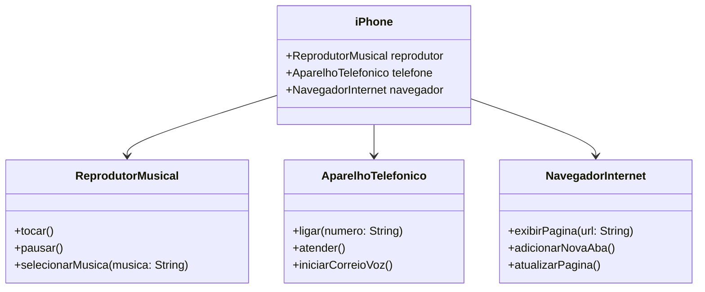

# 📱 Modelagem e Implementação de um Componente iPhone

Este repositório contém a modelagem UML e a implementação em Java de um componente **iPhone**, abrangendo funcionalidades como **🎵 Reprodutor Musical**, **📞 Aparelho Telefônico** e **🌐 Navegador na Internet**.

## 🎯 Objetivo

- Criar um **diagrama UML** representando as funcionalidades do iPhone.
- Implementar as classes e interfaces correspondentes em **Java**.
- Demonstrar o funcionamento do sistema com um arquivo **Main.java**.

## 📂 Estrutura do Projeto

O projeto segue uma abordagem de **Programação Orientada a Objetos (POO)**, utilizando **interfaces** para definir as funcionalidades e uma classe principal `iPhone` que implementa todas elas.

### 📌 Diagrama UML

## 🚀 Como Executar

1. **Clonar o repositório**:
```sh
git clone https://github.com/IsisVct/Interface-UML-iPhone
```

2. **Compilar os arquivos Java**:
```sh
javac *.java
```

3. **Executar o programa**:
```sh
java Main
```

## 🎭 Saída Esperada

```sh
Música selecionada: Superpowers
Reproduzindo música...
Música pausada.
Ligando para: 9876543210
Atendendo chamada...
Iniciando correio de voz...
Exibindo página: https://github.com/IsisVct
Nova aba adicionada.
Página atualizada.
```

## ✅ Conclusão

Este exercício demonstrou a modelagem e implementação de um **componente iPhone** usando **Programação Orientada a Objetos (POO)** com **interfaces** para modularidade. A estrutura pode ser expandida para adicionar novas funcionalidades e melhorias.

---

